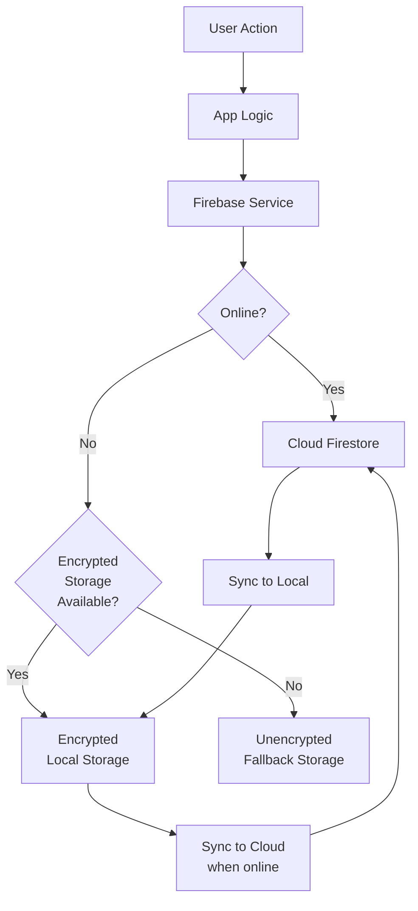

# Dosify

A medication management app built with Flutter.

## Project Structure

lib/
├── constants/         # Variable definitions and calculations
│   ├── med_variables.dart
│   ├── dose_variables.dart
│   ├── cycles_variables.dart
│   ├── schedules_variables.dart
│   └── supplies_variables.dart
├── models/           # Data models
│   ├── medication.dart
│   ├── dose.dart
│   ├── schedule.dart
│   └── reconstitution_calculator.dart
├── screens/          # UI screens
│   ├── auth/        # Authentication screens
│   ├── base_service_screen.dart # Base screen with service access
│   ├── home/        # Main app screens
│   └── medications/ # Medication management screens
│       └── add_medication/ # Specialized medication input screens
├── services/        # Business logic and services
│   ├── encryption_service.dart
│   ├── firebase_service.dart
│   └── service_locator.dart # Dependency injection container
├── theme/           # App theming
│   ├── app_colors.dart
│   ├── app_text_styles.dart
│   └── app_decorations.dart
└── widgets/         # Reusable UI components
    ├── help_card.dart # Help card components
    └── upcoming_doses_widget.dart # Upcoming doses display

## Architecture

Dosify follows a service-oriented architecture with dependency injection for better testability and maintainability.

### Dependency Injection

The app uses the `get_it` package to implement a service locator pattern for dependency injection:

```dart
// Service registration
serviceLocator.registerLazySingleton<FirebaseService>(
  () => FirebaseService(
    firestore: serviceLocator<FirebaseFirestore>(),
    auth: serviceLocator<FirebaseAuth>(),
    encryptionService: serviceLocator<EncryptionService>(),
    prefs: serviceLocator<SharedPreferences>(),
  ),
);

// Service usage in screens
final FirebaseService firebaseService = serviceLocator<FirebaseService>();
```

### Base Service Screen

All screens that need access to services inherit from `BaseServiceScreen`, which provides:

- Access to all registered services
- Common UI utilities (loading dialogs, error handling)
- Authentication state access
- Service initialization

```dart
class MyScreen extends BaseServiceScreen {
  @override
  State<MyScreen> createState() => _MyScreenState();
}

class _MyScreenState extends BaseServiceScreenState<MyScreen> {
  void loadData() {
    // Access services directly
    final data = await firebaseService.getData();
    
    // Show loading/error dialogs
    showLoadingDialog();
    try {
      // Do something
    } catch (e) {
      showErrorDialog('Error', e.toString());
    } finally {
      hideDialog();
    }
  }
}
```

### Service Layer

Services handle all business logic and data access:

1. **EncryptionService**: Handles secure data storage with encryption/decryption
2. **FirebaseService**: Manages Firebase interactions and local data caching
3. **ServiceLocator**: Manages dependency injection and service lifecycle

### UI Components

Reusable UI components follow a consistent pattern:

1. **Configuration-based initialization**: Components can be created from configuration objects
2. **Consistent styling**: Components use theme data for consistent appearance
3. **Persistence-aware**: Components can save their state when needed

Example with Help Cards:

```dart
// Create a help card from configuration
final helpCard = CollapsibleHelpCard.fromConfig(
  HelpCardConfig(
    title: 'Help Title',
    content: 'Help content goes here',
    steps: ['Step 1', 'Step 2'],
    initiallyExpanded: true,
  ),
);

// Persistent help card that remembers dismissal state
final persistentCard = PersistentHelpCard.fromConfig(
  HelpCardConfig(
    title: 'Important Info',
    content: 'This card remembers when dismissed',
    storageKey: 'unique_key',
  ),
);
```

## Database Integration Hierarchy

Dosify implements a robust three-tiered storage architecture:

### Storage Layers

1. **Firebase Firestore (Cloud)**
   - Primary data store when online
   - Automatic synchronization
   - User authentication integration
   - Document-based NoSQL structure

2. **Encrypted Local Storage**
   - Secure offline data access
   - AES-256 encryption
   - Transparent fallback when offline
   - Automatic sync when connection restored

3. **Unencrypted Local Fallback**
   - Last resort when encryption keys unavailable
   - Minimal sensitive data storage
   - Basic functionality preservation

### Document Structure

```
users/
  ├── {userId}/
  │   ├── medications/
  │   │   └── {medicationId}/
  │   │       ├── details
  │   │       └── inventory_history/
  │   │           └── {entryId}
  │   ├── doses/
  │   │   └── {doseId}/
  │   │       └── details
  │   └── schedules/
  │       └── {scheduleId}/
  │           └── details
  └── settings/
      └── {userId}/
          └── preferences
```

### Data Flow Architecture



### Key Integration Features

1. **Offline-First Operation**
   - App functions fully offline
   - Transparent sync when connection available
   - No disruption to user experience

2. **Data Encryption**
   - AES-256 encryption for all sensitive data
   - Secure key storage using platform security features
   - Transparent encryption/decryption

3. **Failsafe Mechanisms**
   - Graceful degradation across storage tiers
   - Data integrity validation
   - Automatic recovery procedures

4. **Data Access Patterns**
   - Optimized query caching
   - Batched write operations
   - Incremental updates

5. **Authentication Integration**
   - Firebase Authentication
   - User-specific data isolation
   - Permission-based access control

## Code Improvement Plan

### Critical Issues

1. **Duplicate Schedule Models**
   - Two nearly identical schedule models exist: `Schedule` and `MedicationSchedule`
   - Causes enum conflicts with duplicate `DoseStatus` definitions
   - Creates confusion in the codebase and type conversion issues
   - **Solution**: Consolidate into a single model with medication-specific fields optional

2. **Encryption Service Issues**
   - Incorrect import usage causing namespace conflicts with `encrypt` package
   - Missing implementation of critical methods (`encrypt`, `decrypt`)
   - **Solution**: Fix imports and implement missing methods

3. **Firebase Service Type Conflicts**
   - Stream vs List type conflicts in `getMedications()` method
   - Missing methods (`getDose`, `getMedication`)
   - **Solution**: Implement missing methods and fix return type handling

### Improvement Priorities

1. **Model Consolidation**
   - Merge `Schedule` and `MedicationSchedule` into a single model
   - Standardize on one `DoseStatus` enum
   - Update all references throughout the codebase

2. **Service Layer Fixes**
   - Complete the encryption service implementation
   - Fix Firebase service method signatures and implementations
   - Add proper error handling and logging

3. **Code Organization**
   - Implement proper dependency injection
   - Add comprehensive documentation
   - Improve test coverage

4. **Performance Optimization**
   - Optimize database queries
   - Implement caching for frequently accessed data
   - Reduce unnecessary rebuilds in the UI

### Implementation Plan

1. Fix critical build errors
2. Consolidate schedule models
3. Complete service implementations
4. Refactor for better organization and maintainability
5. Add comprehensive tests
6. Optimize performance

## Performance Optimizations

The app includes several performance optimizations to ensure smooth operation even with large datasets:

### Query Optimization

The `QueryOptimizer` class provides optimized Firestore queries with:

1. **Intelligent Caching**: Queries are cached with configurable TTL (Time To Live)
2. **Automatic Retry**: Failed queries are automatically retried with exponential backoff
3. **Batch Operations**: Write operations are automatically batched to avoid Firestore limits
4. **Fallback Mechanisms**: Gracefully falls back to cached data when network is unavailable

```dart
// Example of optimized query
final snapshot = await queryOptimizer.getQueryWithCache(
  query,
  cacheKey: 'medications_query_$userId',
  cacheDuration: const Duration(minutes: 5),
);
```

### Multi-Level Caching

The `CacheManager` provides a sophisticated caching system with:

1. **Memory Cache**: Ultra-fast in-memory cache for frequently accessed data
2. **Persistent Cache**: Data persists across app restarts
3. **TTL Support**: Time-based cache expiration
4. **Type Safety**: Generic methods for type-safe cache access

```dart
// Example of cache usage
final cachedData = cacheManager.get<List<Medication>>('key');
await cacheManager.set('key', data, ttl: Duration(hours: 1));
```

### Offline Support

The app is designed to work seamlessly offline:

1. **Firestore Persistence**: Automatic caching of Firestore data
2. **Local-First Operations**: Operations work locally first, then sync when online
3. **Background Sync**: Data is synchronized in the background when connectivity is restored
4. **Conflict Resolution**: Smart merging of local and remote data

### Memory Management

Efficient memory usage through:

1. **Lazy Loading**: Data is loaded only when needed
2. **Resource Cleanup**: Proper disposal of resources when no longer needed
3. **Stream Management**: Efficient handling of Firestore streams
4. **Cache Eviction**: Automatic cleanup of expired cache entries

## Recent Changes

The following updates have been applied to address the Code Improvement Plan:

- **Model Consolidation Completed**: Merged `MedicationSchedule` into `Schedule` model. Removed duplicate `DoseStatus` enum. Updated all references in screens, services, and widgets.
- **Encryption Service Fixed**: Corrected imports, implemented missing `encrypt` and `decrypt` methods.
- **Firebase Service Updates**: Resolved type conflicts in `getMedications()`, added missing `getDose` and `getMedication` methods, improved error handling.
- **Added New Features**: Introduced offline sync service, pagination models, input validation utils, conflict resolution dialog, and additional tests.
- **General Refactoring**: Improved dependency injection, added documentation, optimized performance with caching and query optimizations.
- **File Changes**: Deleted `lib/models/medication_schedule.dart`, added new files like `lib/services/offline_sync_service.dart`, `lib/core/`, etc.
- **Dependencies**: Updated `pubspec.yaml` and `pubspec.lock` for new packages.
- **Firebase Service Refactoring**: Extracted internal classes (FirebaseConnectionManager, MedicationRepository, DoseRepository, ScheduleRepository, FirebaseCacheManager, FirebaseErrorHandler) to separate files in lib/services/ for better modularity and maintainability.
- **Encryption Implementation**: Added encryption and decryption methods for dose and schedule data in EncryptionService. Integrated these into DoseRepository and ScheduleRepository for secure data handling when adding, updating, and retrieving doses and schedules.

These changes enhance the app's maintainability, performance, offline capabilities, and data security.

- **Calendar Integration**: Added ScheduleCalendar widget for visual scheduling on medication details screen, with daily/weekly/monthly views and interactive editing capabilities.
- **Error Resolution**: Fixed type cast errors in Medication model by handling null dates gracefully with a safe parsing helper. Resolved linter errors in add_vial_recon_medication_screen.dart by correcting Medication constructor parameters.
